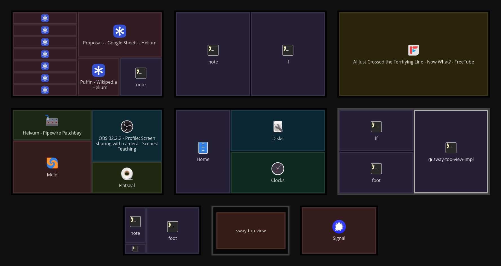

# sway-panorama

A live overview of Sway workspaces in one Wayland window. Each workspace is drawn at a
position and scale on an overview plane given in the config file. Windows are drawn
schematically (title, app icon, color per app) or with their live content.



Pointer controls:

- left click on a window or title bar: focus it, switching to its workspace
- left click elsewhere on a workspace, or on a placeholder: switch to that workspace (Sway
  creates a missing workspace on its assigned output, else on the focused output)
- left button drag (beyond 4 pixels): pan
- scroll wheel: zoom around the pointer
- right button, or the `keys.reset` key (default `0`): fit the plane to the window again
  (the default view)

Keys also toggle the display of icons (`i`), app colors (`c`), titles (`t`) and workspace
names (`w`); see `[keys]` below. Toggled states last until the config file changes.

## Requirements

- Sway. The tree is read through Sway IPC when Sway reports a window, workspace, output or
  key binding event, and also every `poll_interval` milliseconds, because Sway sends no event
  for some changes, such as resizes, layout changes, borders and gaps set by commands.
- Content mode needs per-window capture (`ext-foreign-toplevel-image-capture-source-v1`),
  which Sway has since 1.12. With an older Sway, the program prints a message and draws
  windows schematically. Windows on hidden workspaces are captured live as well.

## Build

```sh
cargo build --release
```

## Config

`$XDG_CONFIG_HOME/sway-panorama/config.toml` (default `~/.config/sway-panorama/config.toml`),
or the path given as the first argument. Changes to the file apply when it is saved; a file
with errors is reported and the previous config stays in effect.

```toml
content = "all"        # "none": schematic, "visible": capture visible workspaces only, "all"
poll_interval = 500    # milliseconds; 0 disables polling
label_size = 16        # height of workspace labels and window titles, in screen pixels
icon_size = 48         # size of app icons, in screen pixels
icon_title_gap = 6     # space between the icon and the title of a window, in screen pixels
workspace_border = 3   # screen pixels, outside the workspace
window_border = 2      # screen pixels, inside the window
margin = 0             # plane units around the workspaces, measured like the space between them
pixel_snap = false     # round box edges, text and icons to whole pixels
show_icons = true
show_titles = true
show_workspace_names = true
app_colors = true      # a fill color per app, of equal OKLab lightness; false fills gray
wrap_titles = true     # wrap titles wider than their window
shrink_titles = true   # reduce the font size of titles that do not fit, after wrapping
# font = "Noto Sans"   # default: the system sans-serif font
# icon_theme = "Adwaita"  # default: the GTK icon theme

[keys]                 # xkb key names with optional Ctrl+, Alt+, Shift+, Super+ prefixes
reset = "0"
toggle_icons = "i"
toggle_colors = "c"    # toggles app_colors
toggle_titles = "t"
toggle_workspace_names = "w"

[colors]               # all optional, "#rrggbb" or "#rrggbbaa"
background = "#1e1e1e"
workspace = "#2a2a2a"
bar = "#3a3a3a"        # the area the output reserves outside the workspace, such as a bar
app_lightness = 0.28   # OKLab lightness of window fills: app colors, whose hue comes from the
                       # app name, and the gray of windows without app color
app_chroma = 0.04      # OKLab chroma of app colors
app_hue_offset = 0     # degrees added to the hue of every app color
text = "#dddddd"

[colors.workspace_border]
normal = "#555555"
visible = "#999999"    # shown on its output
focused = "#4c9ad9"
urgent = "#d03030"

[colors.window_border] # also the fill of title bars
focused = "#4c9ad9"
urgent = "#d03030"
lightness = 0.4        # OKLab lightness of the normal border, with the chroma and hue of the fill

# One table per shown workspace, keyed by workspace name. x and y are plane coordinates;
# scale is plane units per Sway layout pixel. A workspace overview covers its output.
[workspace."1"]
x = 0
y = 0
scale = 1

[workspace."2"]
x = 4080
y = 0
scale = 1
```

Only the listed workspaces are shown. A listed workspace that does not exist is drawn as a
dimmed placeholder.

The view fits the plane to the window, so only relative positions and scales matter. With
`margin` equal to the space between workspaces, the space between the outer workspace borders
and the window edge equals the space between two workspace borders, on the axis that limits
the zoom; the other axis gets the remaining space. Scale 1
for the workspaces of the largest output makes one plane unit one pixel of that output.
All hues of app colors and their borders lie inside sRGB if `app_chroma` is at most 0.17 times
the lower of `app_lightness` and `colors.window_border.lightness`, both at most 0.75 (above,
the limit falls: about 0.10 at 0.8, 0.05 at 0.9). For example, lightness 0.28 and 0.4 allow
chroma up to 0.047. Colors outside sRGB are clipped.

Labels, icons and borders keep their size in screen pixels at every zoom; an icon shrinks only
when its window is smaller on screen. Workspace borders lie outside the workspace, and window
borders lie inside the window, so windows reach the edges of their workspace. The icon and the title of a window are centered
together in it. Title bars and their text scale with the zoom, because they are part of the
window geometry.

Without `pixel_snap`, boxes, borders, text and icons are drawn at their real valued positions,
with anti-aliased edges. Text is placed at quarter pixels horizontally and at whole pixels
vertically (cosmic-text hinting). Captured window content is always placed at whole pixels,
because subsurfaces have integer positions and sizes; the image itself keeps its real valued
position and scale, and only its clipped edge lies on a pixel boundary.

## Sway setup

The window has app_id `sway-panorama`.

As a persistent window, placed with rules, for example:

```
for_window [app_id="sway-panorama"] floating enable, sticky enable, resize set 800 450
exec sway-panorama
```

As an overview toggled by a key, through the scratchpad:

```
for_window [app_id="sway-panorama"] move scratchpad, resize set 90 ppt 90 ppt
exec sway-panorama
bindsym $mod+Tab [app_id="sway-panorama"] scratchpad show
```

While the window is hidden, Sway sends it no frame callbacks, so window capture stops.
